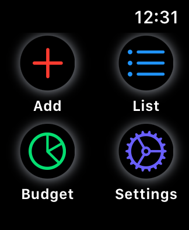
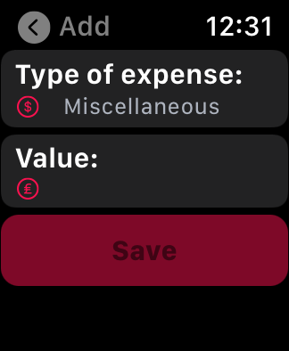

# watchOS-Expenses24
watchOS app - Expenses24. Created using SwiftUI. Available for watchOS 6.0 and newer.

<table>
  <tr>
  <td></td>
  <td></td>
  <td></td>
  </tr>
  <tr>
  <td></td>
  <td></td>
  <td></td>
  </tr>
 </table>

Expenses24 allow user to track daily expenses. User can add expenses, that are saved with date using CoreData. Overview of expenses can be shown in List, where each record, which consists of Expense category with expense value, is ordered in descending daily sections according to date added. User can also set preferred currency and daily budget - upper cap of daily budget. This gives the possibility to display Budget chart with opportunity to see available equity of budget cap for each day.
